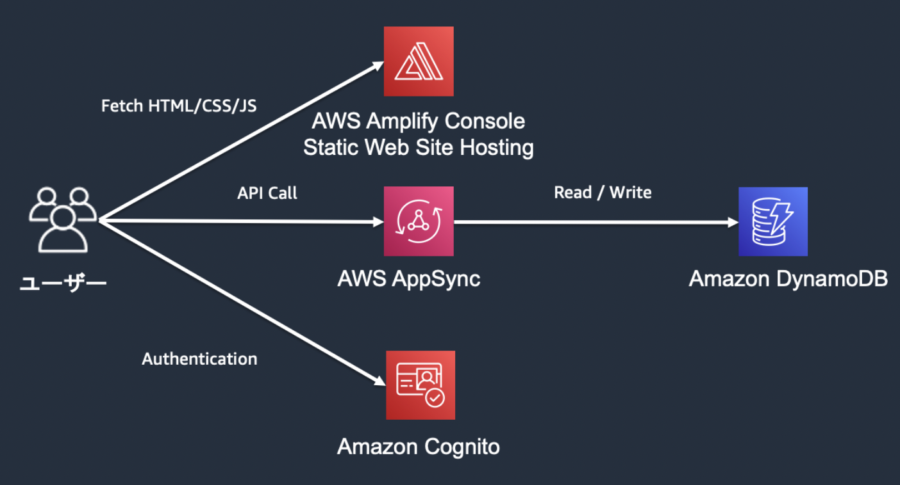

# AWS Amplify ハンズオン

## 本日のハンズオンについて
今回のハンズオンではAWS Amplifyを使用したReactアプリケーション構築とWeb上への公開までを行います。  
使用するサービスは以下の通りとなります。  

## 主な構成

### フロントエンド
- React
- **AWS Amplify Console Static Web Site Hosting**

### バックエンド
- AppSync
- DynamoDB
- Cognito 
