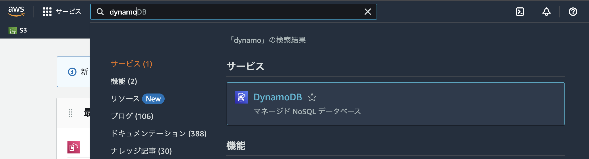
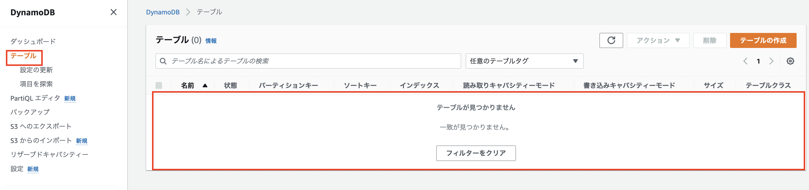
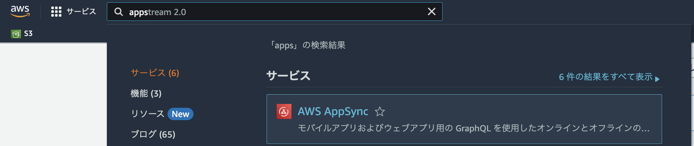
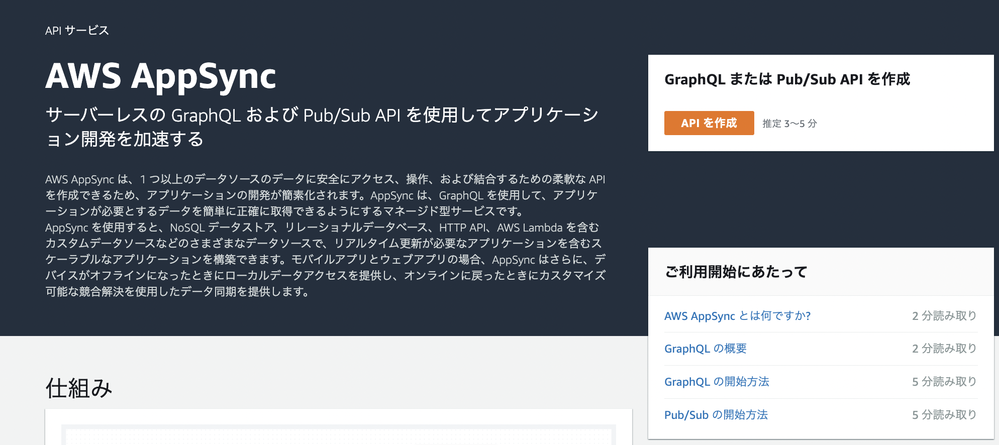
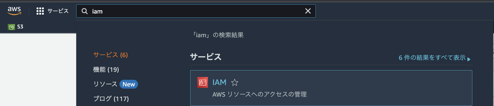
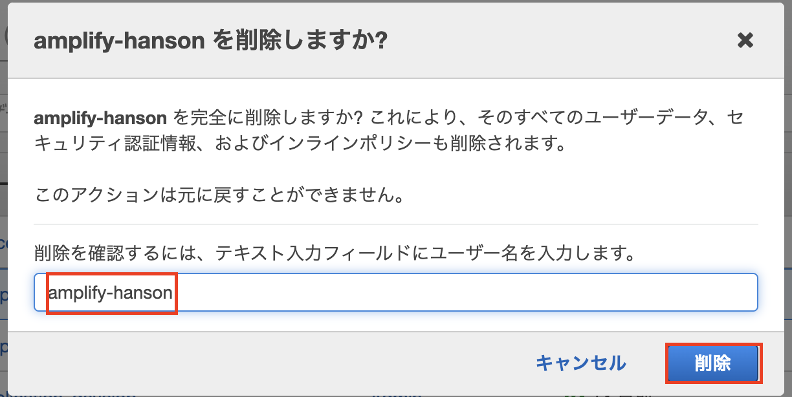
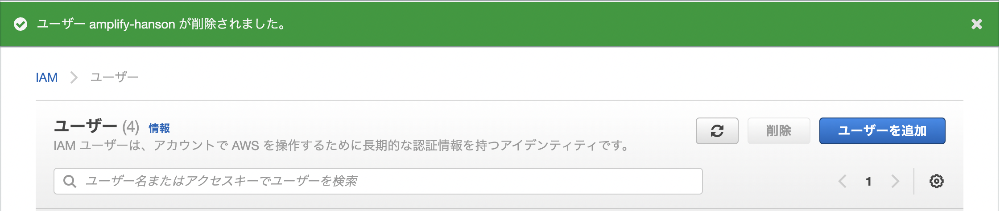

# Amplifyの削除
Amplifyで管理しているリソースを削除します。

## リソースの削除
**react-amplified**のディレクトリ内で以下のコマンドを実行してください。  
```
amplify delete
```

確認メッセージが表示されるので**Y**で進みます。  
```
? Are you sure you want to continue? This CANNOT be undone. (This will delete all the environments of the project from the cloud and wipe out all the local files created by Amplify CLI) (y/N) y
```

削除に数分かかります。  
```
⠋ Deleting resources from the cloud. This will take a few minutes.
Deleting env: dev.
✔ Project deleted in the cloud.
✅ Project deleted locally.
```

**Project deleted locally**と削除完了メッセージが表示されたら実際に削除がされているか確認します。  
今回削除対象になったリソースは**DynamoDBのテーブル**と**AppSyncのGraphQL API**になります。  

### DynamoDB
AWSのマネジメントコンソールを開き、**東京リージョン**であることを確認します。  
検索バーに**dynamo**と入力すると、サービス欄にDynamoDBが表示されるので選択します。  



DynamoDBの画面が表示されるので、左メニューの**テーブル**を選択します。  
先程のハンズオン中にあった**ToDoxxxx**というテーブルがなくなっていることを確認出来たら削除完了です。




### AppSync
DynamoDB同様にマネジメントコンソールを開き、**東京リージョン**であることを確認します。  
検索バーに**apps**と入力すると、サービス欄にAppSyncが表示されるので選択します。  



APIがない場合は以下の画面が表示されるので、以下の画面が表示されていれば削除されています。




ここまででAmplifyが管理しているリソースの削除は完了です。

## IAMユーザーの削除
AmplifyCLIで利用したのですが、Amplifyの管轄外なのでIAMユーザーは手動で消す必要があります。  

AWSのマネジメントコンソールを開き、**東京リージョン**であることを確認します。  
検索バーに**iam**と入力すると、サービス欄にIAMが表示されるので選択します。  



今回のハンズオンで使用した**amplify-hanson**を選択し、`削除`ボタンを押します。


確認画面が表示されるので、テキストボックスに**amplify-hanson**と入力して`削除`ボタンを押します。



以下の画面が表示されたらIAMユーザーの削除は完了です。


