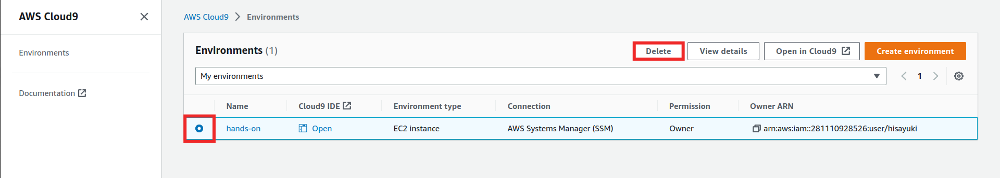
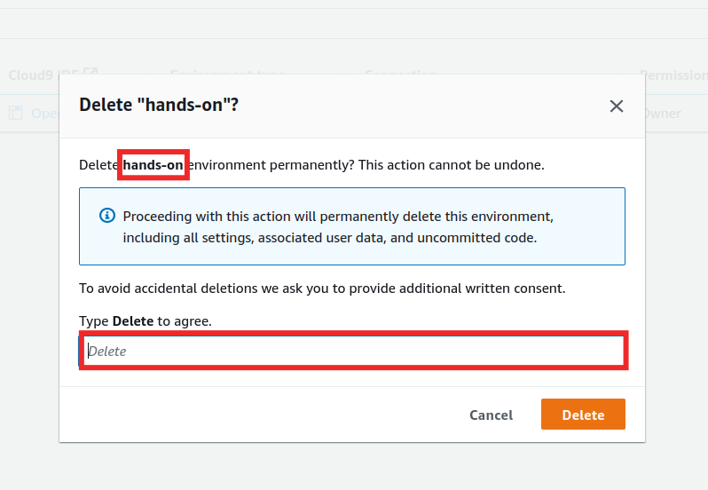
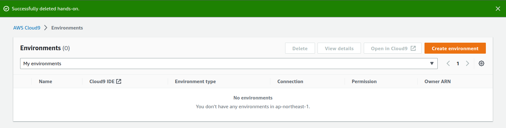
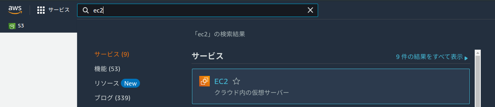
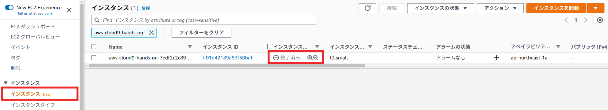

# Cloud9の削除
今回使用したCloud9の削除を行います。  
Cloud9は**EC2インスタンスを使用しているので**消し忘れないようにしてください。  

## マネジメントコンソールから削除する
AWSのマネジメントコンソールを開き、**東京リージョン**であることを確認します。  
検索バーに`cloud9`と入力すると、サービス欄にCloud9が表示されるので選択します。  

**hands-on**を選択して`Delete`を押します。  

確認画面が表示されるので削除する環境が**hands-on**になっていることを確認し、テキストボックスに**Delete**を入力します。  
入力したら`Delete`ボタンを押します。  

削除には数分かかることあります。  
削除が完了すると以下のように表示されます。  

Cloud9側で削除完了したらリソース側も消えていることを確認します。

### EC2
EC2の画面に移動します。  
検索バーに`ec2`と入力すると、サービス欄にEC2が表示されるので選択します。  

EC2の画面に移動したら**インスタンス**を選択します。  
Cloud9で使用したインスタンスが**終了済み**のステータスになっていることを確認します。  

