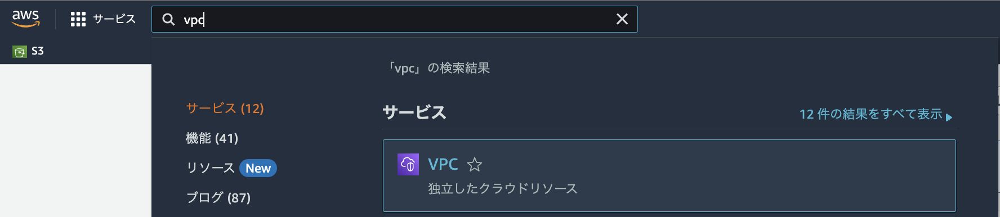
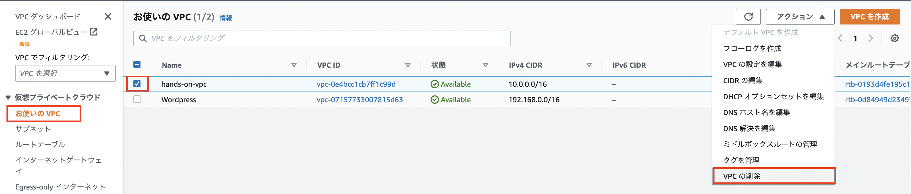
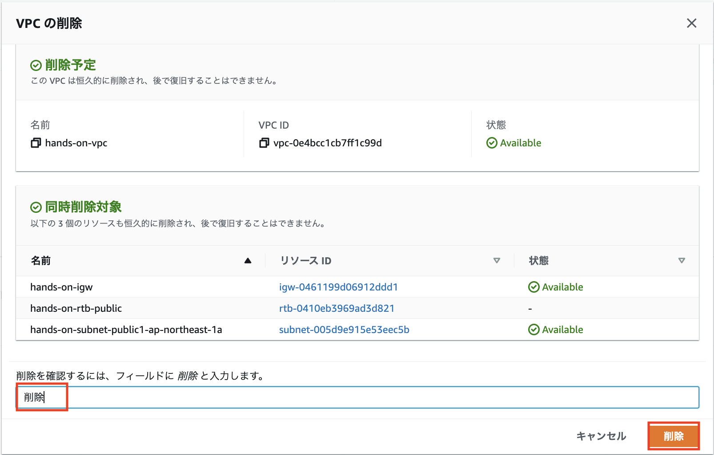
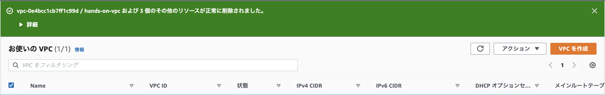
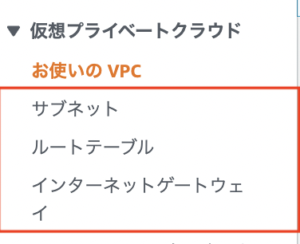

# VPCの削除
今回のために作成したVPCも消していきます。

## マネジメントコンソールから削除
AWSのマネジメントコンソールを開き、**東京リージョン**であることを確認します。  
検索バーに**vpc**と入力すると、サービス欄にVPCが表示されるので選択します。

VPCの画面に移動したら左側のメニューから**お使いのVPC**を選択します。  
VPCの一覧が表示されたら今回作成した**hands-on-vpc**という名前のVPCを選択します。  
選択しましたら右上の**アクション**から**VPCの削除**を選択します。  

削除対象のVPC、サブネット、ルートテーブル、インターネットゲートウェイが表示されるので、確認してから確認フィールドに削除を入力してから`削除`を押します。

削除が完了したら以下の画面が表示されるので、VPCが消えていることを確認します。 

また、サブネット、ルートテーブル、インターネットゲートウェイの各リソースも削除されていることを確認してください。  

ここまででVPCの削除が完了となります。
