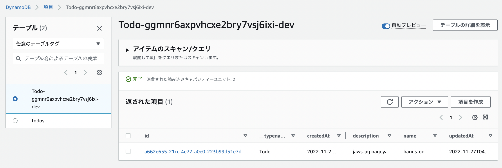

# ClientとAPIの接続
APIの準備ができたのでReactアプリケーションからAPIを通してデータの取得や登録をできるようにします。  

## Todoアプリケーションの作成
準備で作成したReactアプリケーションをTodoアプリケーションにしていきます。  
まず、 **src/App.js**を開いて以下のコードを上書きします。  

```javascript
import React, { useEffect, useState } from 'react'
import { Amplify, API, graphqlOperation } from 'aws-amplify'
import { createTodo } from './graphql/mutations'
import { listTodos } from './graphql/queries'

import awsExports from "./aws-exports";
Amplify.configure(awsExports);

const initialState = { name: '', description: '' }

const App = () => {
  const [formState, setFormState] = useState(initialState)
  const [todos, setTodos] = useState([])

  useEffect(() => {
    fetchTodos()
  }, [])

  const setInput = (key, value) => setFormState({ ...formState, [key]: value })
  
  const fetchTodos = async() => {
    const todoData = await API.graphql(graphqlOperation(listTodos)).catch(_ => console.log('error fetching todos'))
    const todos = todoData.data.listTodos.items
    setTodos(todos)
  }

  const addTodo = async () => {
    if(formState.name && formState.description) {
      const todo = { ...formState }
      setTodos([...todos, todo])
      setFormState(initialState)
      await API.graphql(graphqlOperation(createTodo, {input: todo})).catch(err => console.log('error creating todo:', err))
    }
  }

  return (
    <div style={styles.container}>
      <h2>Amplify Todos</h2>
      <input
        onChange={event => setInput('name', event.target.value)}
        style={styles.input}
        value={formState.name}
        placeholder="Name"
      />
      <input
        onChange={event => setInput('description', event.target.value)}
        style={styles.input}
        value={formState.description}
        placeholder="Description"
      />
      <button style={styles.button} onClick={addTodo}>Create Todo</button>
      {
        todos.map((todo, index) => (
          <div key={todo.id ? todo.id : index} style={styles.todo}>
            <p style={styles.todoName}>{todo.name}</p>
            <p style={styles.todoDescription}>{todo.description}</p>
          </div>
        ))
      }
    </div>
  )
}

const styles = {
  container: { width: 400, margin: '0 auto', display: 'flex', flexDirection: 'column', justifyContent: 'center', padding: 20 },
  todo: {  marginBottom: 15 },
  input: { border: 'none', backgroundColor: '#ddd', marginBottom: 10, padding: 8, fontSize: 18 },
  todoName: { fontSize: 20, fontWeight: 'bold' },
  todoDescription: { marginBottom: 0 },
  button: { backgroundColor: 'black', color: 'white', outline: 'none', fontSize: 18, padding: '12px 0px' }
}

export default App
```

**src/App.js**を上記のコードに書き換えたら、Reactアプリケーションの動作確認したとき同様に**Preview**から動作確認をします。  


以下のようにTodoアプリケーションが動作したら、実際に**Name**と**Description**を入力してみます。


`Create Todo`を押してみてください。  
以下のようにTodo項目が表示されたら成功です。


DynamoDB側にも登録されていることが確認できます。  
DynamoDBのテーブル名は**ToDo**までは同じですが、それ以降は人によってバラバラになります。  



Todoアプリケーションの作成についてはここまでで完了となります。