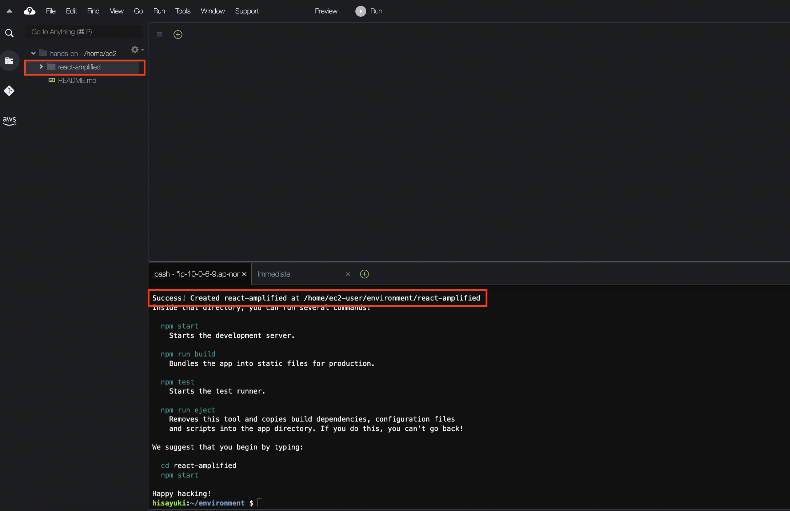
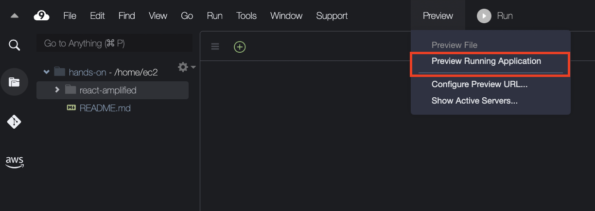
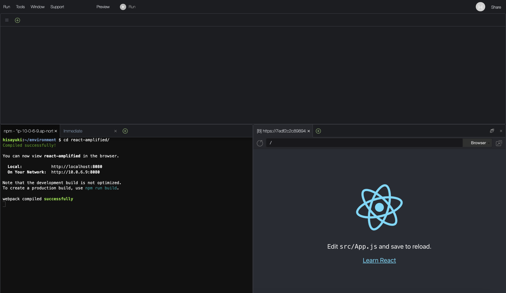

# プロジェクトの準備
今回のハンズオンで使用するアプリケーションをReactで作成していきます。  
基本的には記載しているコードをそのまま使うだけで良いようにします。  

## 新規Reactアプリケーションの作成
Reactのテンプレートアプリケーションを作成します。  
Cloud9のターミナルで以下のコマンドを実行してください。 

```
npx create-react-app react-amplified
```

`Need to install the following packages`と質問されるので、`y`と入力します。  
```
Need to install the following packages:
  create-react-app@5.0.1
Ok to proceed? (y) y
```

**react-amplified**というプロジェクトが作成されます。  



プロジェクトが作成されたのが確認できたらプロジェクトディレクトリ内に移動します。  
Cloud9のターミナルで以下のコマンドを実行してください。 
```
cd react-amplified
```

作成したReactアプリケーションが正常に動作するかを確認します。  
```
npm start
```

**Compiled successfully!**と表示されたらアプリケーションが正常に動作しています。  
```
Compiled successfully!

You can now view react-amplified in the browser.

  Local:            http://localhost:8080
  On Your Network:  http://10.0.6.9:8080

Note that the development build is not optimized.
To create a production build, use npm run build.

webpack compiled successfully
```

Cloud9で動作しているReactProjectを確認します。  
上部のメニューにある`Preview`を押し、`Preview Running Application`を選択します。  



このように右下に動作しているアプリケーションを確認できます。  



確認ができましたら、**Ctrl + C**で一旦止めておきます。  
アプリケーションの動作確認はこのあとも使う機会があるので、動かし方と止め方は覚えておいてください。  

ここまでで今回使用するReactアプリケーションの準備は完了となります。  