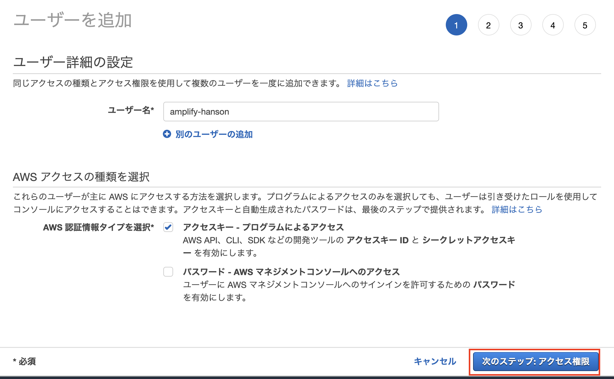
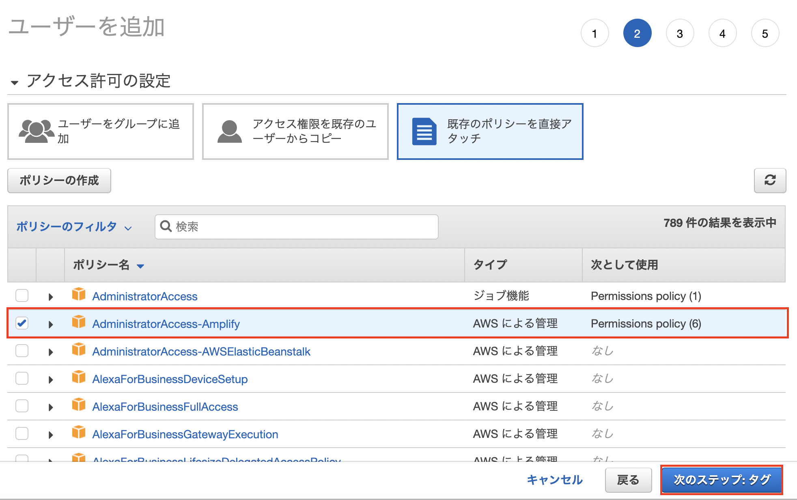
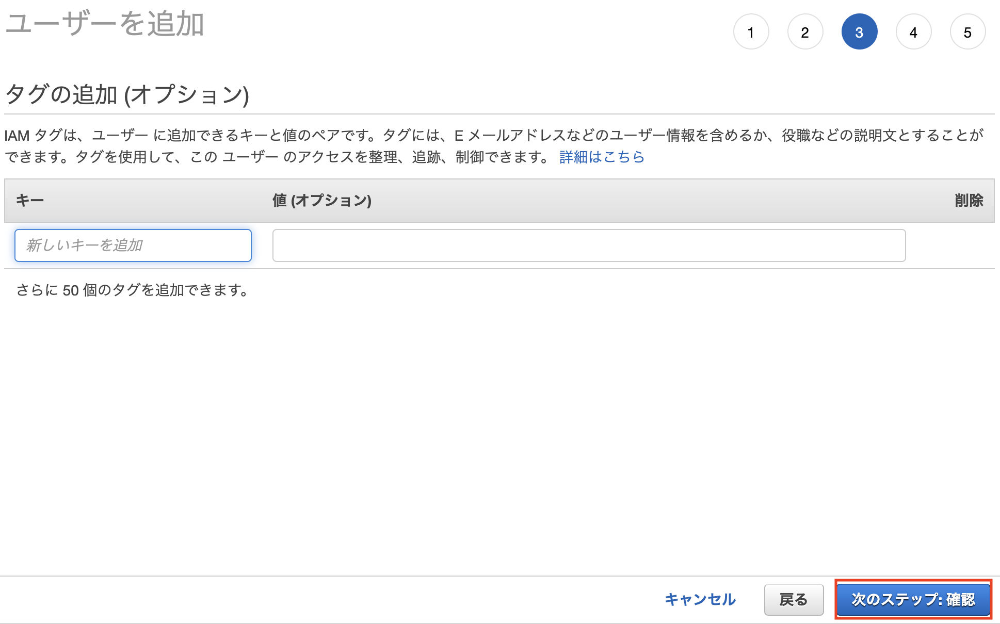
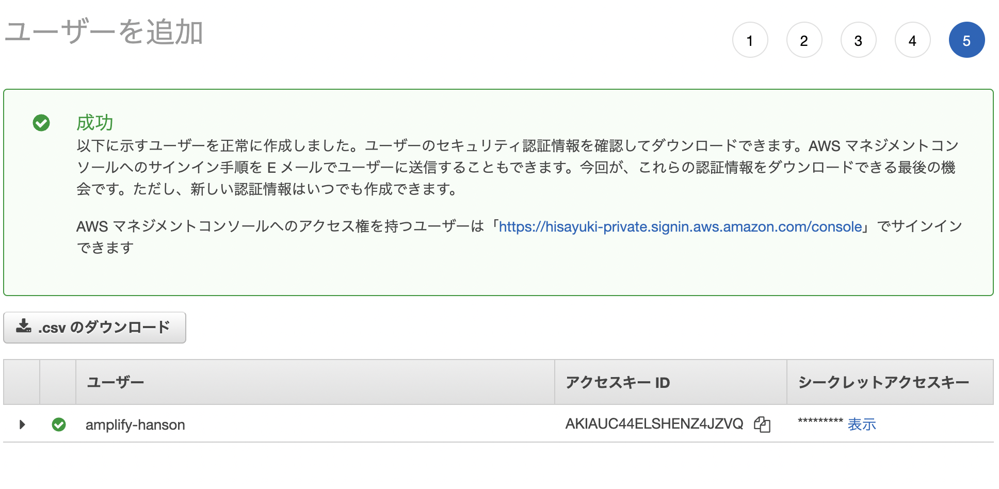

# CLIのインストール

## Nodeのバージョン確認
nodeについてはCloud9にすでにインストール済みなので確認のみとなります。  
Cloud9のターミナルで以下のコマンドを実行してください

```shell
node -v
```

`v16.18.1`と表示されたらそのまま進みます。

## Amplify CLIのインストール
Amplifyのインストールを進めていきます。
Cloud9のターミナルで以下のコマンドを実行してください

```shell
npm install -g @aws-amplify/cli
```

次にAmplifyのセットアップを行うため、以下のコマンドを実行してください

```
amplify configure
```

このように**Session Identifier**が表示されたらEnterキーを押します。

```
Follow these steps to set up access to your AWS account:

Sign in to your AWS administrator account:
https://console.aws.amazon.com/
Press Enter to continue
🛑 spawn xdg-open ENOENT

Resolution: Please report this issue at https://github.com/aws-amplify/amplify-cli/issues and include the project identifier from: 'amplify diagnose --send-report'
Learn more at: https://docs.amplify.aws/cli/project/troubleshooting/

Session Identifier: c8409a47-d71c-448a-99e5-xxxxxxxxxxxxxx
```

リージョンを聞かれるので東京リージョンである**ap-northeast-1**を選択して、Enterを押します。
```
Specify the AWS Region
? region:  
  eu-west-2 
  eu-west-3 
  eu-central-1 
❯ ap-northeast-1 
  ap-northeast-2 
  ap-southeast-1 
  ap-southeast-2 
(Move up and down to reveal more choices)
```

次に作成されるIAMユーザー名を聞かれるので**amplify-hanson**とします。
```
Specify the username of the new IAM user:
? user name:  amplify-hanson
```

ユーザー名を設定すると、以下のようなURLが発行されます。  
発行されたURLを押し、次の画面に移動します。
```
Complete the user creation using the AWS console
https://console.aws.amazon.com/iam/home?region=ap-northeast-1#/users$new?step=final&accessKey&userNames=amplify-hanson&permissionType=policies&policies=arn:aws:iam::aws:policy%2FAdministratorAccess-Amplify
```

IAMユーザーを作成する画面に遷移するので、そのまま`次のステップ:アクセス権限`を押します。  


ポリシーについても**AdministratorAccess-Amplify**が付与されていることを確認して、`次のステップ：タグ`を押します。  


タグは特に指定しないのでそのまま`次のステップ：確認`を押します。  


ユーザー名が**amplify-hanson**であることと、管理ポリシーに**AdministratorAccess-Amplify**があることを確認したら`ユーザーの作成`で先に進みます。  


IAMユーザーが作成されたら**アクセスキー ID**と**シークレットアクセスキー**を控えておきます。  
CSVをダウンロードしておくのが良いです。  


Cloud9に戻りEnterを押します。  
次に先程作成した**アクセスキー ID**と**シークレットアクセスキー**の入力を求めらるので入力します。  

```
Enter the access key of the newly created user:
? accessKeyId:  ********************
? secretAccessKey:  ****************************************
```

次にProfile名を聞かれますが、今回はハンズオンで使うだけなのでデフォルトのまま進めます。  
特に入力せずEnterを押すと、**default**となります。　　
```
Enter the access key of the newly created user:
? accessKeyId:  ********************
? secretAccessKey:  ****************************************
This would update/create the AWS Profile in your local machine
? Profile Name:  default

Successfully set up the new user.
```

ここまででCLIの準備は完了となります。  
