# Cloud9の環境構築
今回は全員が同じ環境でハンズオンができるようにCloud9を使って行います。

## Cloud９のインスタンス作成
- AWSのマネジメントコンソールを開き、**東京リージョン**であることを確認します。
- 検索バーに`cloud9`と入力すると、サービス欄にCloud9が表示されるので選択します。

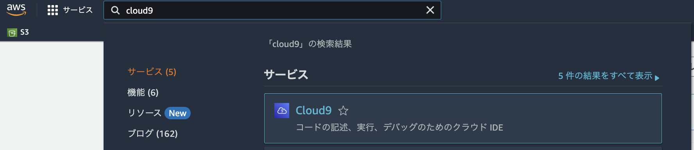

- 画面から`Create environment`を選択します。

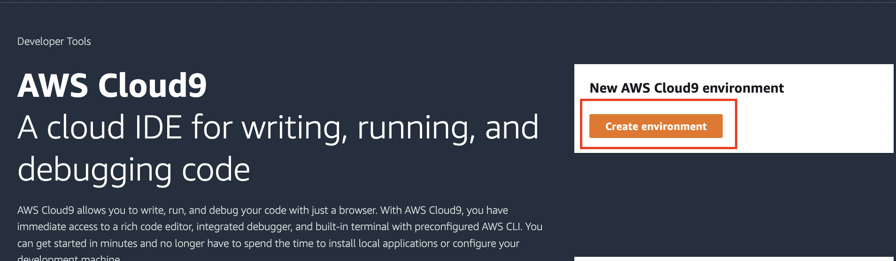

- Cloud9の環境構築をしていきます。まず`Details`項目の`Name`には **hanson** と入力します。残りの`Description`と `Environment type`についてはそのままでよいです。

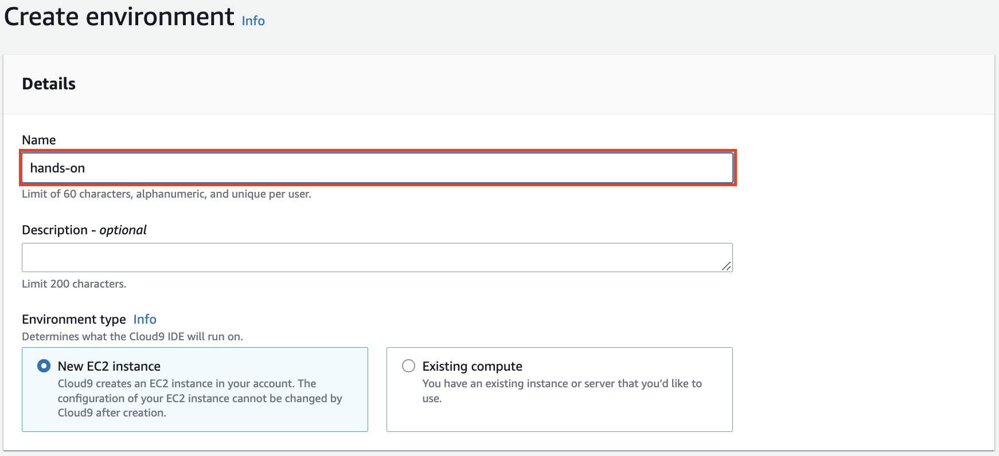

- EC2のインスタンスタイプは**`t3.small`**を選択します。残りの`Platform`と`Timeout`はそのままでよいです。

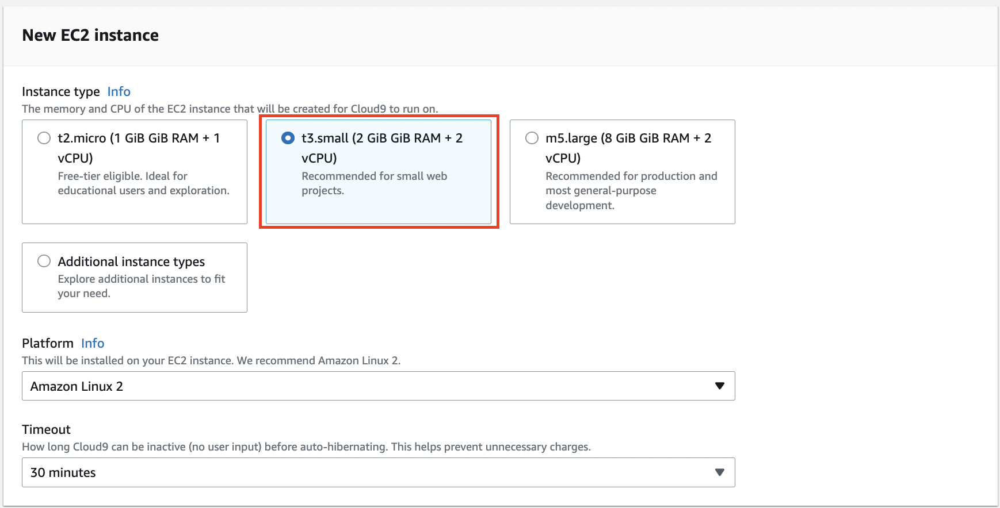

- Networkについては`Connection`は`AWS Systems Manager (SSM)`になっていればそのままでよいです。`VPC settings`は[作成したVPC](vpc.md#create_vpc)とSubnetを明示的に選択するようにします。

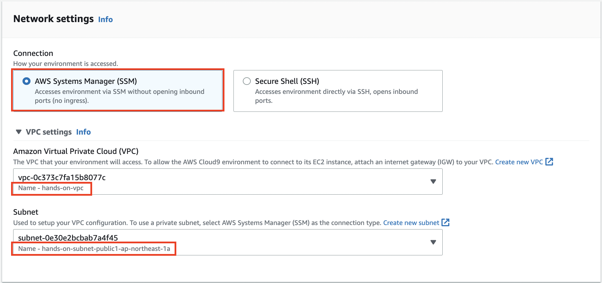

- ここまでの設定が完了したら、画面の下にある`Create`ボタンを押してください。


## クレデンシャル無効化
Cloud9を開いたときに発行される一時認証情報が発行されますが、今回はAmplifyで発行される認証情報を使用するためCloud9側の認証情報の発行を無効化します。

- Cloud9ボタンを押し、`Preference`を選択します。

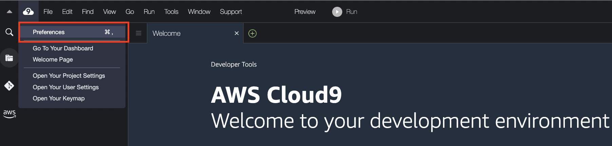

- `AWS Setting`を選択します。

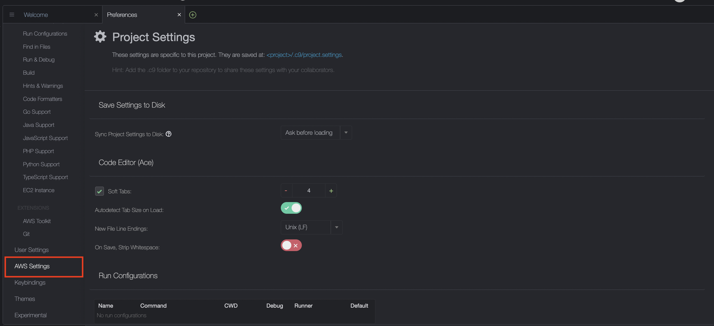

- `AWS managed temporary credentials`をオフにします

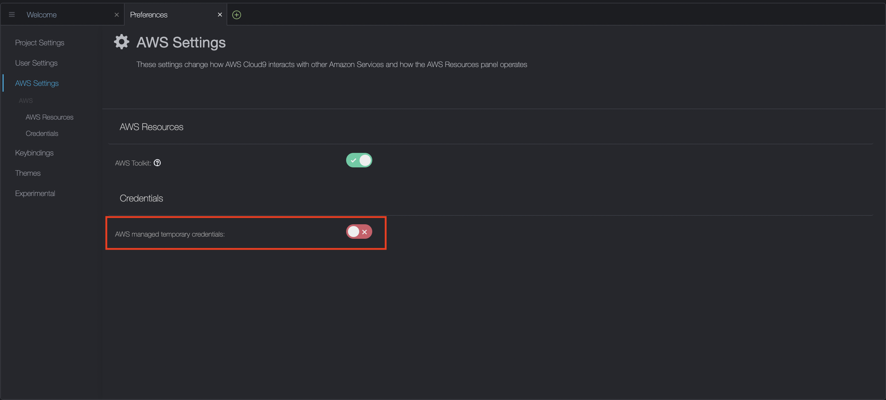

## EBSのボリュームを上げる
デフォルトのままではEBSのボリュームが不足してしまう可能性があるので容量をあげます。

- 現状の容量を確認します。Cloud9のターミナルで以下のコマンドを実行してください。

```
df -h
```

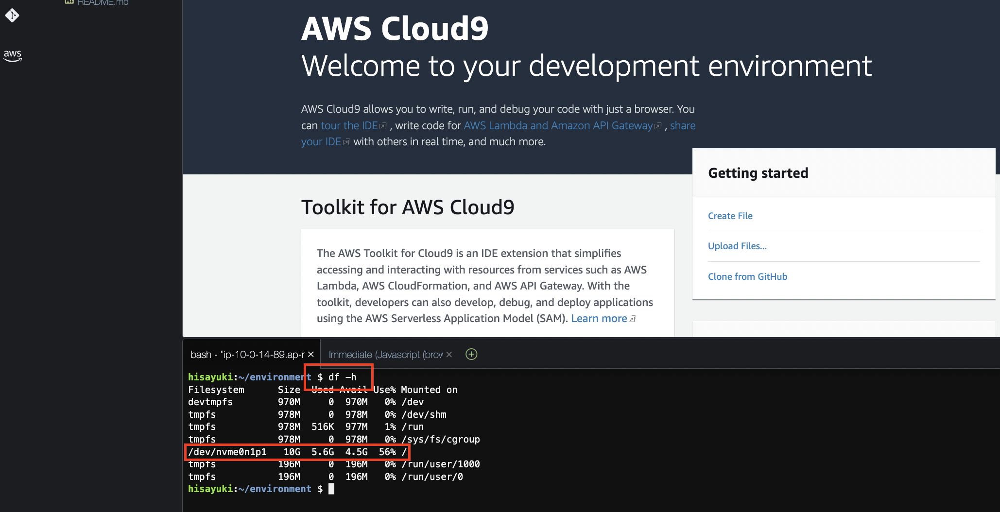

- EBSのsizeが現状10Gなのを確認したら、32Gに増やすためにEBSの設定を変更します。
- Cloud9ボタンを押し、`Go To Your Dashboard`を選択します。

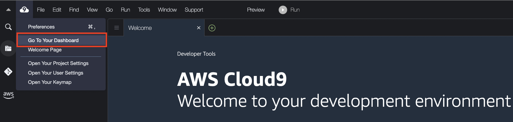

- 作成したCloud9環境を選択します。

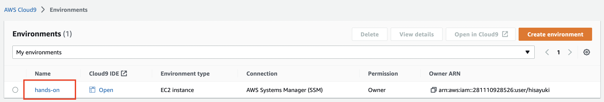

- `Manage EC2 instance`を選択します。

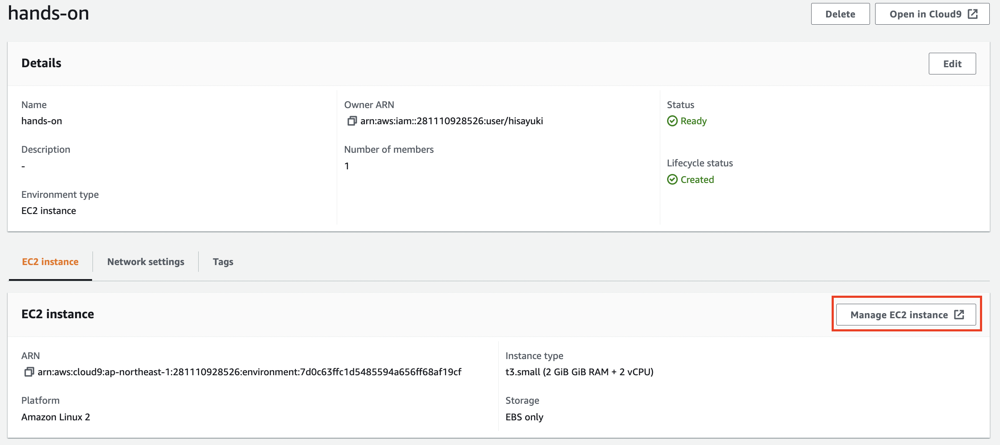

- EC2インスタンスの一覧画面が表示されるので、Cloud9のインスタンスIDを選択します。

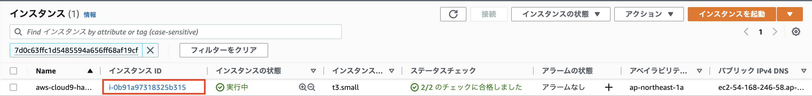

- EBSのボリュームを変更する場合はインスタンスを停止している必要があるので、`インスタンスの状態`からインスタンスを停止します。

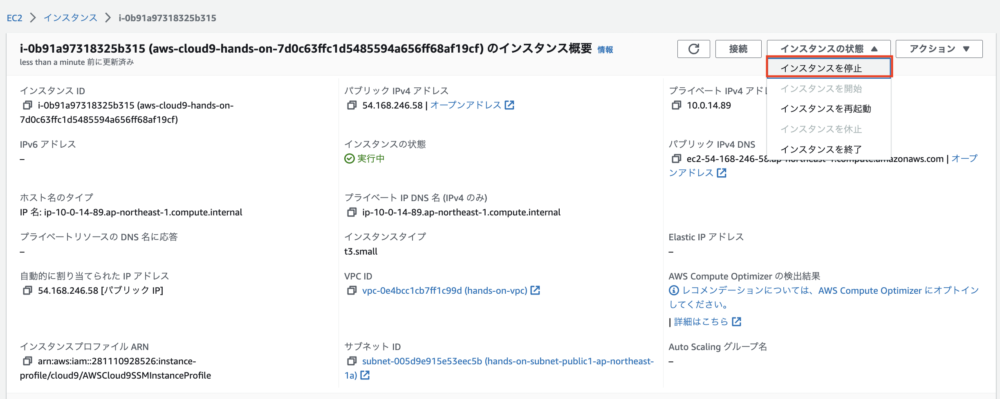

- 確認画面が表示されるので停止ボタンを押します。

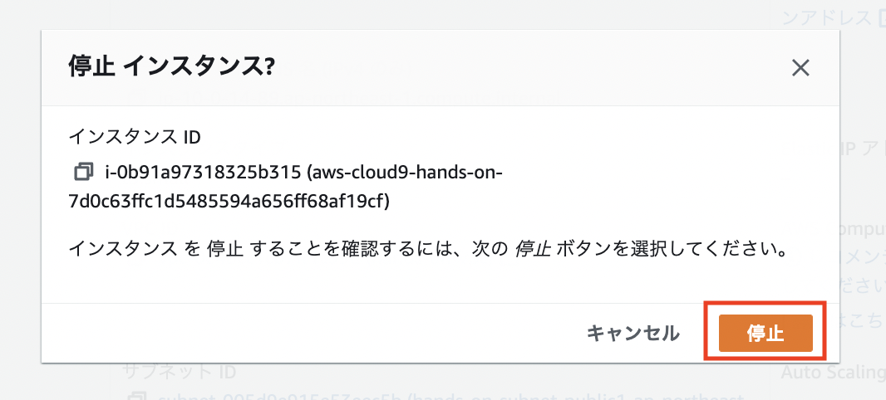

- 停止後に同じ画面でストレージタブを押し、ボリュームIDを選択します。

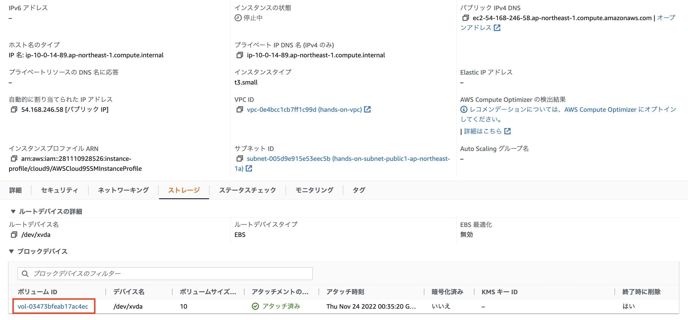

- EBS一覧の中で指定したボリュームIDを選択し、`アクション`ボタンから`ボリュームの変更`を選択します。

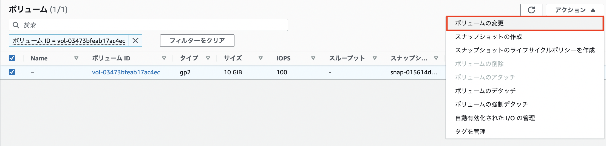

- サイズを`32`に変更して`変更`ボタンを押します。

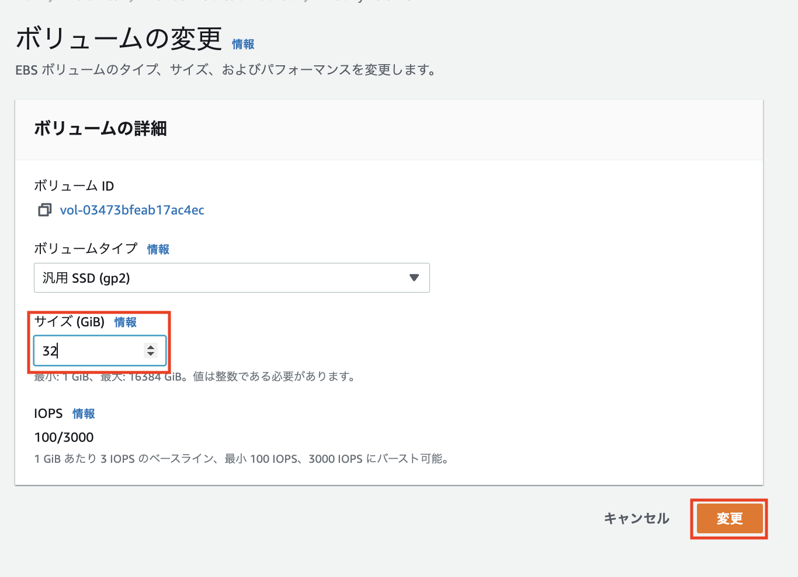

- 確認画面が表示されるので変更ボタンを押します。

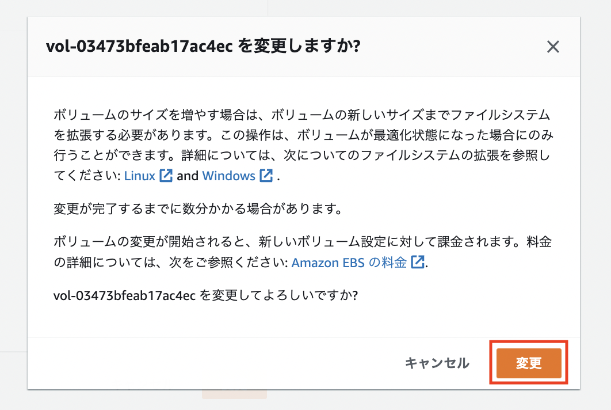

- 再度Cloud9に戻り、ボリュームのsizeが増えている事が確認できたらEBSの設定は完了です。

```
df -h
```

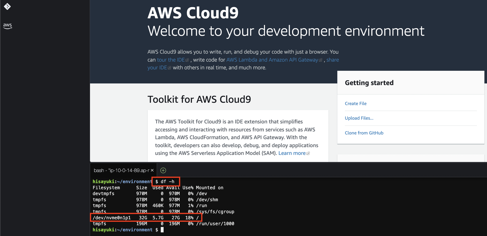

ここまででCloud9の環境構築は完了です。