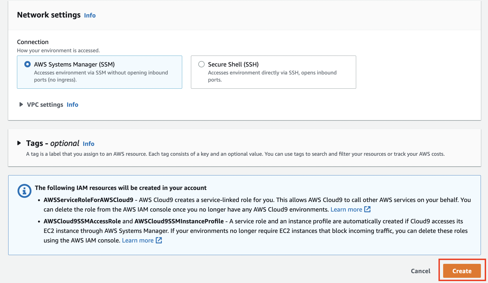

# Cloud9の環境構築
今回は全員が同じ環境でハンズオンができるようにCloud9を使って行います。

## Cloud９のインスタンス作成
- AWSのマネジメントコンソールを開き、**東京リージョン**であることを確認します。
- 検索バーに`cloud9`と入力すると、サービス欄にCloud9が表示されるので選択します。

- 画面から`Create environment`を選択します。

- Cloud9の環境構築をしていきます。まず`Details`項目の`Name`には **hanson** と入力します。残りの`Description`と `Environment type`についてはそのままでよいです。

- EC2のインスタンスタイプは**`t3.small`**を選択します。残りの`Platform`と`Timeout`はそのままでよいです。

- Networkについては`Connection`は`AWS Systems Manager (SSM)`になっていればそのままでよいです。`VPC settings`は[作成したVPC](vpc.md#create_vpc)とSubnetを明示的に選択するようにします。

- ここまでの設定が完了したら、画面の下にある`Create`ボタンを押してください。

## Cloud9のクレデンシャル