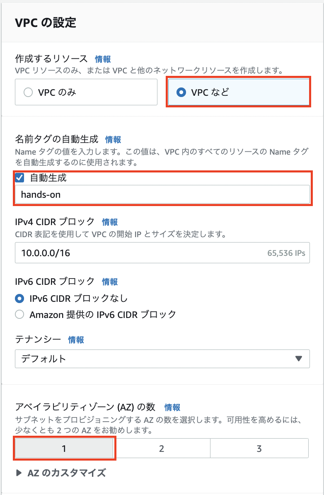

# VPCの用意
ハンズオンに使うCloud9用のVPCを作っていきます。  

## VPCを作成する　
AWSのマネジメントコンソールを開き、**東京リージョン**であることを確認します。  
検索バーに**vpc**と入力すると、サービス欄にVPCが表示されるので選択します。  

`VPCを作成`ボタンを押して作成画面に移ります。  

VPCの設定を以下のようにします。  

|項目|値|
|--|--|
|作成するリソース|VPC など|
|名前タグの自動生成|hands-on|
|アベイラビリティゾーン (AZ) の数 |1|
|パブリックサブネットの数|1|
|プライベートサブネットの数|0|
|VPC エンドポイント|なし|

プレビューがこのように表示されているか確認して、`VPCを作成`ボタンを押します。

作成が完了したら`VPCを表示`でVPC画面に移動します。

## サブネットにパブリックIPを割り当てるようにする
**Cloud9**で使用するEC2インスタンスにはパブリックIPが振られる必要があるので、サブネットから自動割り当てするようにします。  
VPCを作成したあとに遷移した画面で、**サブネット**を選択します。  

作成したサブネットを選択します。  

画面右上の`アクション`ボタンを押し、`サブネットの設定を編集`を選択します。  

**パブリック IPv4 アドレスの自動割り当てを有効化**にチェックを入れて`保存`を押します。  

完了すると以下のような画面が表示されます。  
下段の**詳細タブ**内で**パブリック IPv4 アドレスを自動割り当て**が**はい**になっていたら正常に変更されています。  

ここまででVPCの設定は完了です。